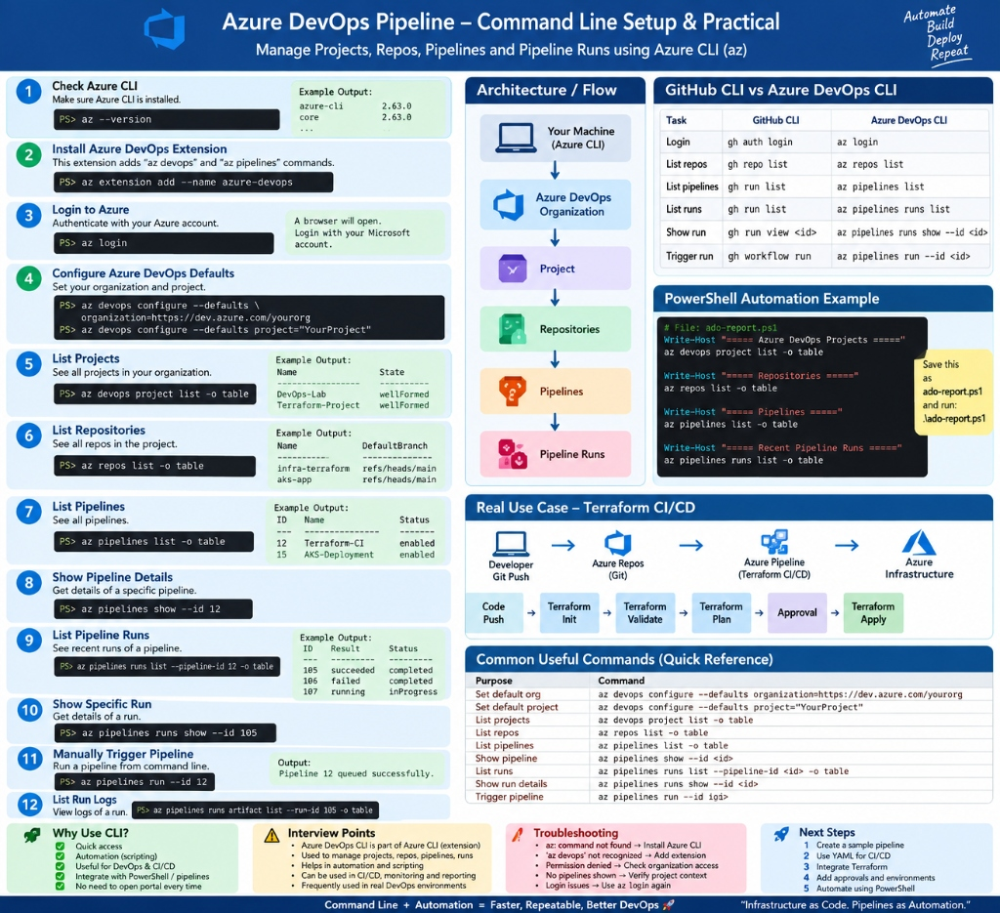

# 🚀 Azure DevOps CLI — Complete Hands-on Guide & Cheat Sheet

[](https://learn.microsoft.com/en-us/cli/azure/)
[](https://learn.microsoft.com/en-us/azure/devops/cli/)
[](https://www.terraform.io/)
[](https://github.com/PowerShell/PowerShell)

> **Goal:** Manage Azure DevOps Projects, Git Repositories, YAML Pipelines, and Pipeline Runs entirely from CMD / PowerShell using the **Azure CLI (`az`)**, just like GitHub CLI (`gh`).

---

## 🖼️ Architecture & Cheat Sheet Infographic

<div align="center">
  
</div>

---

## 📌 Table of Contents

- [Architecture & Workflow](#-architecture--workflow)
- [GitHub CLI (`gh`) vs Azure DevOps CLI (`az`)](#-github-cli-gh-vs-azure-devops-cli-az)
- [Step-by-Step Hands-on Setup](#-step-by-step-hands-on-setup)
  - [1. Check Azure CLI Version](#1-check-azure-cli-version)
  - [2. Install Azure DevOps Extension](#2-install-azure-devops-extension)
  - [3. Authenticate / Login](#3-authenticate--login)
  - [4. Set Default Organization & Project](#4-set-default-organization--project)
  - [5. List Projects](#5-list-projects)
  - [6. List Azure Repos](#6-list-azure-repos)
  - [7. List & Inspect Pipelines](#7-list--inspect-pipelines)
  - [8. Inspect Pipeline Runs & Logs](#8-inspect-pipeline-runs--logs)
  - [9. Manually Trigger a Pipeline](#9-manually-trigger-a-pipeline)
- [Real-World Use Case: Terraform CI/CD](#-real-world-use-case-terraform-cicd)
- [Automation: PowerShell Quick Report (`ado-report.ps1`)](#-automation-powershell-quick-report-ado-reportps1)
- [Troubleshooting & Gotchas](#-troubleshooting--gotchas)
- [Interview Quick Cheat Sheet 🎯](#-interview-quick-cheat-sheet-)
- [Official Documentation Links](#-official-documentation-links)

---

## 🏗 Architecture & Workflow

```text
Your Machine (Azure CLI + Extension)
       │
       ▼  [az login]
Azure DevOps Organization (https://dev.azure.com/YOUR_ORG)
       │
       ▼  [az devops configure --defaults]
Project (DevOps-Lab / Terraform-Project)
       │
       ├──► Azure Repos       [az repos list]
       │
       └──► Azure Pipelines   [az pipelines list]
                 │
                 ├──► Pipeline Runs   [az pipelines runs list]
                 ├──► Run Details     [az pipelines runs show --id <RUN_ID>]
                 └──► Trigger Build   [az pipelines run --id <PIPELINE_ID>]
```

---

## ⚖️ GitHub CLI (`gh`) vs Azure DevOps CLI (`az`)

| Task / Purpose | GitHub CLI (`gh`) | Azure DevOps CLI (`az`) |
| :--- | :--- | :--- |
| **Login / Auth** | `gh auth login` | `az login` |
| **List Repositories** | `gh repo list` | `az repos list -o table` |
| **Clone Repository** | `gh repo clone <ORG/REPO>` | `az repos show --repo <NAME> --query webUrl -o tsv` + `git clone` |
| **List Pull Requests** | `gh pr list` | `az repos pr list -o table` |
| **List Pipelines / Workflows** | `gh workflow list` | `az pipelines list -o table` |
| **List Runs / Executions** | `gh run list` | `az pipelines runs list -o table` |
| **Show Run Details** | `gh run view <RUN_ID>` | `az pipelines runs show --id <RUN_ID> -o table` |
| **Trigger Pipeline / Workflow** | `gh workflow run <WORKFLOW>` | `az pipelines run --id <PIPELINE_ID>` |
| **Open in Web Browser** | `gh browse` | `az pipelines show --id <ID> --open` |

---

## 🛠 Step-by-Step Hands-on Setup

### 1. Check Azure CLI Version
Make sure you have Azure CLI installed on your machine.
```powershell
az --version
```
**Example Output:**
```text
azure-cli                         2.63.0
core                              2.63.0
telemetry                          1.1.0
```

---

### 2. Install Azure DevOps Extension
Azure DevOps capabilities are bundled in the official Microsoft `azure-devops` extension for Azure CLI.

```powershell
# Install the extension
az extension add --name azure-devops

# Ensure you have the latest updates
az extension update --name azure-devops

# Verify extension installation
az extension show --name azure-devops -o table
```

---

### 3. Authenticate / Login
Authenticate your local session with Azure:
```powershell
az login
```
*(Your default web browser opens automatically. Sign in with your Azure DevOps Microsoft account.)*

Check active account:
```powershell
az account show -o table
```

> [!NOTE]
> Azure Subscription context and Azure DevOps Organization/Project RBAC permissions are separate. Ensure your signed-in identity has permissions in your targeted ADO organization.

---

### 4. Set Default Organization & Project
Save yourself from passing `--organization` and `--project` flags with every command:

Ab pehle project name pata karo:

az devops project list --organization https://dev.azure.com/shahiashwani071 -o table
Phir configure karo

Maan lo output mein project:

Name
----------------
ADO-Pipeline

To:

az devops configure --defaults organization=https://dev.azure.com/shahiashwani071 project="ADO-Pipeline"

```powershell
az devops configure --defaults organization=https://dev.azure.com/YOUR_ORG project="YOUR_PROJECT"
```

Verify configured defaults:
```powershell
az devops configure --list
```

---

### 5. List Projects
List all projects accessible within your organization:
```powershell
az devops project list -o table
```

**Example Output:**
```text
ID                                    Name               State        Visibility
------------------------------------  -----------------  -----------  ------------
c731e840-0000-0000-0000-000000000001  DevOps-Lab         wellFormed   private
c731e840-0000-0000-0000-000000000002  Terraform-Project  wellFormed   private
```

---

### 6. List Azure Repos
List all Git repositories under the current project:
```powershell
az repos list -o table
```

**Example Output:**
```text
ID                                    Name             DefaultBranch        Size
------------------------------------  ---------------  -------------------  -------
f1234567-0000-0000-0000-000000000001  infra-terraform  refs/heads/main      245 KB
f1234567-0000-0000-0000-000000000002  aks-deployment   refs/heads/main      180 KB
```

---

### 7. List & Inspect Pipelines

#### 📜 List all pipelines
```powershell
az pipelines list -o table
```
**Example Output:**
```text
ID    Name                    Status     QueueStatus
----  ----------------------  ---------  -------------
12    Terraform-CI            enabled    enabled
15    AKS-Deployment          enabled    enabled
```

#### 🔍 Inspect pipeline details
```powershell
# Show in terminal
az pipelines show --id 12 -o table

# Open pipeline directly in your browser
az pipelines show --id 12 --open
```

---

### 8. Inspect Pipeline Runs & Logs

#### 📋 View recent pipeline runs
```powershell
# List all latest runs
az pipelines runs list -o table

# Fetch top 10 runs
az pipelines runs list --top 10 -o table

# Filter runs for a specific pipeline (e.g. ID 12)
az pipelines runs list --pipeline-ids 12 --top 10 -o table

# Filter runs by git branch
az pipelines runs list --branch main --top 10 -o table
```

**Example Output:**
```text
Run ID    Number           Status       Result       Pipeline Name
--------  ---------------  -----------  -----------  -----------------
105       20260915.1       completed    succeeded    Terraform-CI
106       20260915.2       completed    failed       Terraform-CI
107       20260915.3       inProgress                Terraform-CI
```

#### 🔎 View details of a specific run
```powershell
az pipelines runs show --id 105 -o table

# Open specific run directly in web UI
az pipelines runs show --id 105 --open
```

---

### 9. Manually Trigger a Pipeline

Trigger a pipeline execution from your CLI:

```powershell
# Run pipeline ID 12 on default branch
az pipelines run --id 12

# Run on a specific branch with table output
az pipelines run --id 12 --branch main -o table

# Pass custom pipeline variables
az pipelines run --id 12 --variables TF_ACTION=plan ENVIRONMENT=dev
```

---

## 🌍 Real-World Use Case: Terraform CI/CD

In modern enterprise cloud engineering, Azure DevOps pipelines automate Terraform workflows across staging and production environments.

```text
[Developer Push]
       │
       ▼
[Azure Repos (Git)]
       │
       ▼
[Azure Pipeline: Terraform-CI]
       │
       ├──► terraform fmt -check     (Check code style)
       ├──► terraform init           (Initialize backend & providers)
       ├──► terraform validate       (Validate HCL syntax)
       ├──► terraform plan           (Generate execution plan & diff)
       ├──► [Manual / Environment Approval]
       └──► terraform apply          (Provision resources into Microsoft Azure)
```

DevOps engineers can monitor, check, and trigger these pipelines without leaving their VS Code or CLI terminal using:
```powershell
# Trigger Terraform-CI manually for staging
az pipelines run --id 12 --branch feature/vnet -o table

# Check execution status
az pipelines runs list --pipeline-ids 12 --top 5 -o table
```

---

## ⚡ Automation: PowerShell Quick Report (`ado-report.ps1`)

Automate your daily environment check with a single PowerShell script:

```powershell
# File: ado-report.ps1
Write-Host "========================================" -ForegroundColor Cyan
Write-Host "   AZURE DEVOPS ENVIRONMENT STATUS      " -ForegroundColor Cyan
Write-Host "========================================" -ForegroundColor Cyan

Write-Host "`n[+] Configured Defaults:" -ForegroundColor Yellow
az devops configure --list -o table

Write-Host "`n[+] Repositories:" -ForegroundColor Yellow
az repos list -o table

Write-Host "`n[+] Pipelines:" -ForegroundColor Yellow
az pipelines list -o table

Write-Host "`n[+] Top 5 Latest Pipeline Runs:" -ForegroundColor Yellow
az pipelines runs list --top 5 -o table
```

### Run the script:
```powershell
.\ado-report.ps1
```

---

## ⚠️ Troubleshooting & Gotchas

| Issue | Root Cause | Solution |
| :--- | :--- | :--- |
| `az: command not found` | Azure CLI is not installed or not in PATH | Download & install Azure CLI from Microsoft official site. |
| `'devops' is not an az command` | Extension missing | Run `az extension add --name azure-devops` |
| `Permission Denied / 401 Unauthorized` | ADO Organization permissions missing | Run `az login` with account having project reader/contributor role. Or configure Personal Access Token: `$env:AZURE_DEVOPS_EXT_PAT="<PAT>"`. |
| `No project specified` | Default project not configured | Run `az devops configure --defaults organization=... project=...` or supply `--project "<NAME>"`. |
| `Pipeline not found` | Incorrect Pipeline ID or Project mismatch | Run `az pipelines list -o table` to verify the numeric ID in the target project. |

---

## 🎯 Interview Quick Cheat Sheet

> **💡 The Elevator Pitch:**
> *"Azure DevOps CLI is an official extension of the Azure CLI (`az`) that enables DevOps engineers to automate, inspect, and manage projects, repos, pull requests, pipelines, and runs straight from the terminal or shell scripts without depending on the browser UI."*

### 🚀 Top 10 Core Commands

```bash
# 1. Login
az login

# 2. Add extension
az extension add --name azure-devops

# 3. Configure defaults
az devops configure --defaults organization=https://dev.azure.com/<ORG> project="<PROJECT>"

# 4. List projects
az devops project list -o table

# 5. List repos
az repos list -o table

# 6. List all pipelines
az pipelines list -o table

# 7. Pipeline metadata
az pipelines show --id <PIPELINE_ID> -o table

# 8. List pipeline runs
az pipelines runs list --pipeline-ids <PIPELINE_ID> --top 10 -o table

# 9. Pipeline run details
az pipelines runs show --id <RUN_ID> -o table

# 10. Trigger a pipeline
az pipelines run --id <PIPELINE_ID> --branch main -o table
```

---

## 📚 Official Documentation Links

- 📖 [Manage Pipelines with Azure DevOps CLI](https://learn.microsoft.com/en-us/azure/devops/pipelines/get-started/manage-pipelines-with-azure-cli)
- 📖 [Azure DevOps CLI Extension Reference](https://learn.microsoft.com/en-us/cli/azure/devops)
- 📖 [Azure DevOps CLI in Azure Pipeline Tasks](https://learn.microsoft.com/en-us/azure/devops/cli/azure-devops-cli-in-yaml)

---
*Built with ❤️ for DevOps & Cloud Automation Engineers.*
